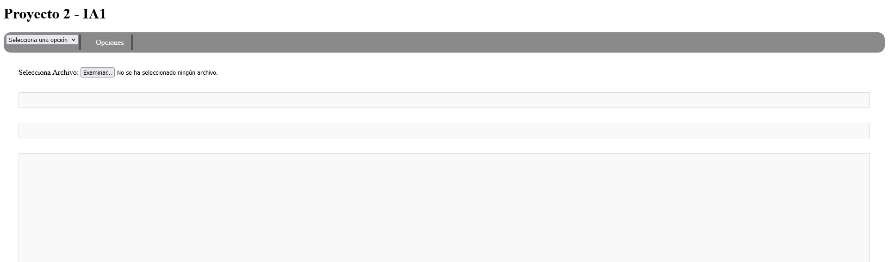
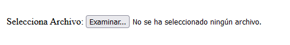
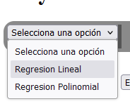
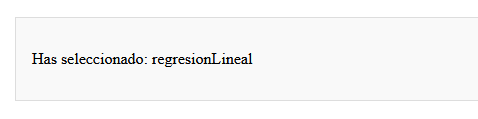
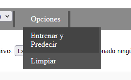
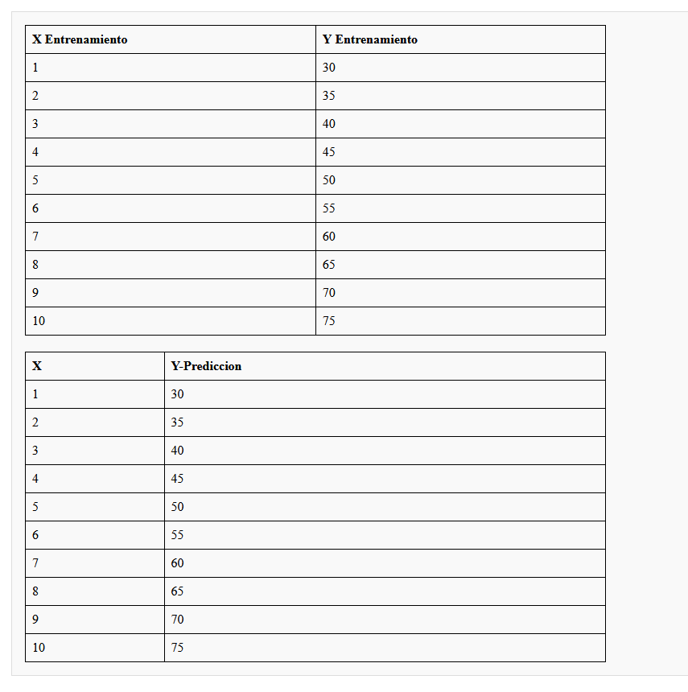
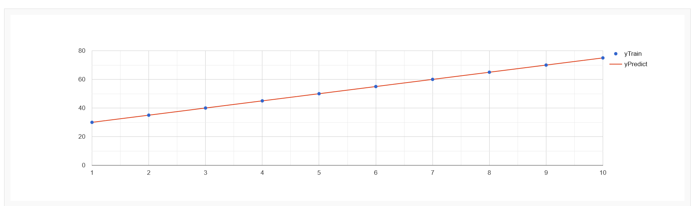
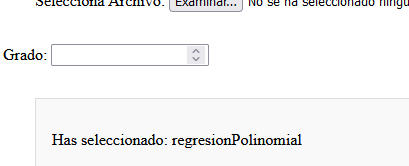

# Manual de Usuario - Proyecto 2 IA1
# 201906053 - Jose Rodrigo Rodas Palencia

La aplicacion esta diseñada para entrenar dos distintos tipos de modelos de machine learning, los cuales pueden armar una prediccion en base a los datos de entrenamiento. A continuacion se describen los apartados y las funcionalidades de la aplicacion.

### Subir Archivo
Como primera parte se tiene un apartado para subir un archivo `.csv` para la carga de los datos para el entrenamiento.

### Seleccion de Modelo

En la barra superior se tiene un campo de seleccion para seleccionar el modelo a entrenar, las dos opciones son Regresion Lineal y Regresion Polinomial.

Cada vez que se seleccione un modelo aparecera un apartado confirmando la seleccion.

### Opciones

En la barra superior se tienen dos opciones para ejecutar, una de ellas entrena y realiza la prediccion del modelo. Antes de Entrenar y Predecir, se debe seleccionar un modelo.

La segunda opcion es la de Limpiar que limpiara cualquier dato u informacion ingresada o generada por la prediccion.

### Apartado de Prediccion

En la parte inferior se tienen dos recuadros los cuales estan destinados para mostrar los datos de entrenamiento cargados asi como la grafica de prediccion generada. Al presionar la opcion de Entrenar y Predecir, se mostraran los datos cargados y la prediccion generada.

En el segundo apartado se mostrara la grafica con los datos de entrenamiento y prediccion generados.

### Parametros

Algunos modelos necesitan parametros para funcionar, como el modelo de Regresion Polinomial que necesita el ingreso de un grado para la creacion de la prediccion.

